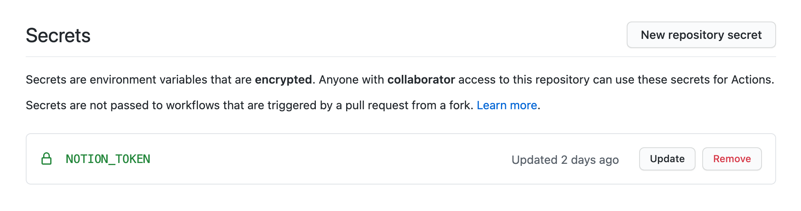
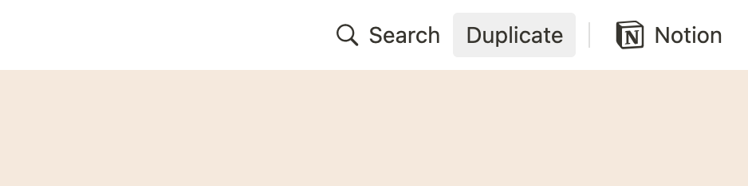

<a align="left" href="https://www.notion.so/Notion2Github-91cf062b276b41cdb78a75672ba31cb3"></a>

# Notion2Github

[](https://github.com/marketplace/actions/notion2github)
[](.github/workflows/notion2github.yml)
[](https://github.com/younho9/narkdown/releases/tag/v1.0.0-beta)
[](./LICENSE)

**Automatic syncronization from Notion to Github**

---

> ⚠️ **NOTE:** Narkdown is dependent on [notion-py](https://github.com/jamalex/notion-py), the **_unofficial_** Notion API created by [Jamie Alexandre](https://github.com/jamalex).
> It can not gurantee it will stay stable. If you need to use in production, I recommend waiting for their official release.

---

## Usage

### Using encrypted token_v2 in a workflow

<div align="center">
  
</div>

The `token_v2` is required to get contents from Notion. The `token_v2` of notion is a variable that should not be shared. So you can use encrypted secrets in your repository.

For more information, See ["Using encrypted secrets in a workflow"](https://docs.github.com/en/free-pro-team@latest/actions/reference/encrypted-secrets#using-encrypted-secrets-in-a-workflow)

| Name             | Description                                                    | Required   | Default  |
| ---------------- | -------------------------------------------------------------- | ---------- | -------- |
| `database-url`   | URL of the Notion database to extract.                         | `required` |          |
| `docs-directory` | Directory in which the Notion pages to extract will be stored. |            | `"docs"` |
| `filter-prop`    | Property of the filter to apply to the notion database.        |            | `""`     |
| `filter-value`   | Value of the filter to apply to the notion database.           |            | `""`     |

### Database template page for test

Here is an [database template page](/acc3dfd0339e4cacb5baae8673fddfad?v=be43c1c8dd644cfb9df9efd97d8af60a) for importing pages from the database. Move to that page, duplicate it, and test it.

<div align="center">
  
</div>

### Example Workflow

Create workflow in `.github/workflows/**.yml`

#### Example 1 (run on push & pull request in main)

```yaml
name: Notion2Github
on:
  pull_request:
  push:
    branches:
      - main
jobs:
  auto-sync-from-notion-to-github:
    runs-on: ubuntu-latest
    steps:
      - name: Checkout code
        uses: actions/checkout@v2

      - name: Notion2Github
        uses: younho9/notion2github@v1.0.0-beta
        with:
          database-url: 'https://www.notion.so/acc3dfd0339e4cacb5baae8673fddfad'
          docs-directory: docs/test
          filter-prop: Category
          filter-value: Test
        env:
          NOTION_TOKEN: ${{ secrets.NOTION_TOKEN }}

      - name: Format documents
        uses: creyD/prettier_action@v3.1
        with:
          prettier_options: --write ./docs/**/*.md
          commit_message: 'docs: Update docs (auto)'
        env:
          GITHUB_TOKEN: ${{ secrets.GITHUB_TOKEN }}
```

#### Example 2 (scheduled)

```yaml
name: Notion2Github
on:
  schedule:
    - cron: '0 14 * * *'
jobs:
  auto-sync-from-notion-to-github:
    runs-on: ubuntu-latest
    steps:
      - name: Checkout code
        uses: actions/checkout@v2

      - name: Notion2Github
        uses: younho9/notion2github@v1.0.0-beta
        with:
          database-url: 'https://www.notion.so/acc3dfd0339e4cacb5baae8673fddfad'
          docs-directory: docs/test
          filter-prop: Category
          filter-value: Test
        env:
          NOTION_TOKEN: ${{ secrets.NOTION_TOKEN }}

      - name: Format documents
        uses: creyD/prettier_action@v3.1
        with:
          prettier_options: --write ./docs/**/*.md
          commit_message: 'docs: Update docs (auto)'
        env:
          GITHUB_TOKEN: ${{ secrets.GITHUB_TOKEN }}
```

> [Useful site for crontab setting](https://crontab.guru/)

### Live examples

- [younho9/narkdown](https://github.com/younho9/narkdown/blob/main/.github/workflows/notion2github.yml)

- [younho9/TIL](https://github.com/younho9/til/blob/main/.github/workflows/notion2github.yml)

## Configuring Narkdown

Narkdown provides some configuration for how to extract documents. You can configure Narkdown via `narkdown.config.json` .

Create `narkdown.config.json` in root directory of your repository.

For more information on configure your environment, [see the document in Nakdown](https://github.com/younho9/narkdown#configuring-narkdown).

```json
// narkdown.config.json
{
  "exportConfig": {
    "recursiveExport": true,
    "createPageDirectory": true,
    "addMetadata": false,
    "lowerPathname": false,
    "lowerFilename": false,
    "lineBreak": false
  },
  "databaseConfig": {
    "categoryColumnName": "Category",
    "tagsColumnName": "Tags",
    "createdTimeColumnName": "Created Time",
    "statusColumnName": "Status",
    "currentStatus": "✅ Completed",
    "nextStatus": "🖨 Published"
  }
}
```

### License

MIT © [younho9](https://github.com/younho9)
