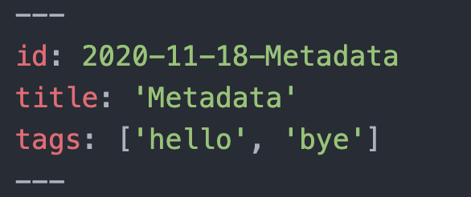

# Metadata

## Date to filename

When set `add_date_to_filename` to `True` , date precedes the filename.

## Add metadata

When set `add_metadata` to `True` , then, `id` , `title` , `tags` data will be inserted at the top of the content.

